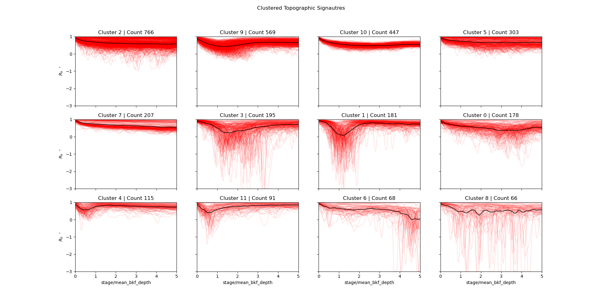

## Classifying Floodplain Types for Flood Attenuation

This repository provides tools to explore the influence of floodplain-channel connectivity on flood celerity and flood routing processes.  Current functionality includes
* Extraction of reach-averaged hydraulic geometry from DEMs
* Derivation of river reach "topographic signatures"
* Clustering of "topographic signatures" using a Gaussian Mixture Model (GMM)
* Generation and cleaning of geomorphon maps from DEMs

## Reach-averaging process

To analyze reach characteristics, we subset topographic information within a reach polygon.  We are currently using NHDPlus, NOAA hydrofabric, and VT Stream Geomorphic Assesment catchment data to delineate reach areas of influence.  The map below shows an example catchment area of influence.

Reach-averaged hydraulic parameters may then be extracted from the DEM within the area of influence.

## Signature clustering

"Topographic Signatures" are a concept that the University of Vermont is actively developing.  In simple terms, topo signatures represent the ease with which a river spills out into the adjacent terrain.  We can use ML clustering methods on a large dataset of reach topographic signatures to view emergent hydraulic properties of river reaches across various settings.

The example below shows a preliminary clustering of the NHDPlus Reaches within the Lake Champlain basin of Vermont.

The dataset of topographic signatures is available at https://www.hydroshare.org/resource/0c21a05466944561b6513cde333a1655/

