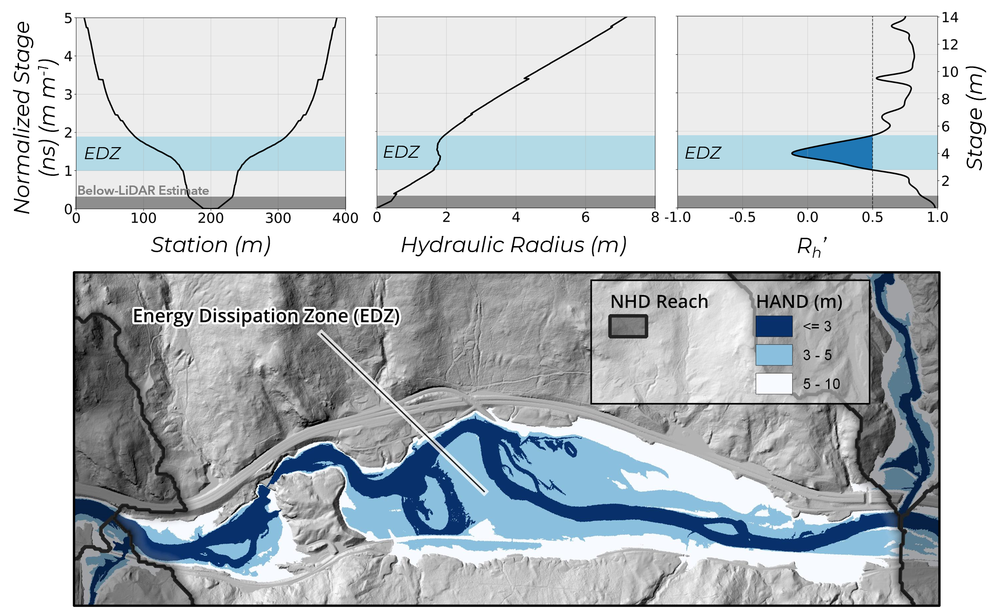

# Tools for Extracting Reach-Averaged Geometry from Digital Elevation Models

[](https://zenodo.org/badge/latestdoi/630477245)

## Summary



This repository contains tools for extracting hydraulic geometry parameters (top width, flow area, hydraulic radius, etc) from a river reach as a function of river stage.  Geometry parameters are averaged over a reach using the methods of Diehl et al. (2021) and Matt et al. (2023). Once geometric information has been extracted, tools are also available to identify and map Energy Dissipation Zones (EDZs) and map design flood extents.

## Current Functionality
 - Download NHDPlus-HR reach delineations.
 - Refactor the NHDPlus-HR network to a more consistent reach length
 - Extract hydraulic geometry parameters rating curves from each reach.  Avalable parameters are
   - stage
   - stage / bankfull depth
   - top-width
   - flow-area
   - wetted perimeter
   - hydraulic radius
   - first derivative of hydraulic radius (Rh')
- Add an estimate for below-lidar bathymetry
- Identify EDZ stage ranges and extract metrics to describe EDZ extent, size, connectivity, etc
- Calculate flood-specific EDZ metrics such as the volume of water in the EDZ for a given flood event
- Map EDZ extents and design flood extents

## Data Requirements

To run these tools you will need

1. Reach delineations.  These may be manually delineated or can be downloaded from NHDPlus-HR and refactored.  If using manual delineations, you will need to have the following attributes for each reach: drainage area (square kilometers), length (meters), and slope (m/m).
2. Height Above Nearest Drainage (HAND) raster.  Several tools exist to generate this raster from a DEM, but we recommend the [TauDEM Tool](https://hydrology.usu.edu/taudem/taudem5/help53/DInfinityDistanceDown.html).
3. Slope raster.  raster with each cell representing the drop/distance from that cell to its lowest adjacent neighbor.  Several tools exist for generating this raster, but we recommend taking it as the optional output from [TauDEM Tool](https://hydrology.usu.edu/taudem/taudem5/help53/DInfinityFlowDirections.html).

## Running the Scripts

To start, clone this repository using

```console
git clone https://github.com/CIROH-UVM/floodplain-routing.git
```

Then, put your data into the folder structure shown in [samples](samples).  Several tutorials on script execution are available in [General](https://github.com/CIROH-UVM/floodplain-routing/tree/main/docs/General).


## References

Diehl RM, Gourevitch JD, Drago S, Wemple BC (2021) Improving flood hazard datasets using a low-complexity, probabilistic floodplain mapping approach. <i>PLOS ONE</i> 16(3): e0248683. https://doi.org/10.1371/journal.pone.0248683

Matt, J. E., Underwood, K. L., Diehl, R. M., Lawson, K. S., Worley, L. C., & Rizzo, D. M. (2023). Terrain-derived measures for basin conservation and restoration planning. <i>River Research and Applications</i>, 39(9), 1795–1811. https://doi.org/10.1002/rra.4181


## Funding
Funding for this project was provided by the National Oceanic & Atmospheric
Administration (NOAA), awarded to the Cooperative Institute for Research to
Operations in Hydrology (CIROH) through the NOAA Cooperative Agreement
with the University of Alabama (NA22NWS4320003).

