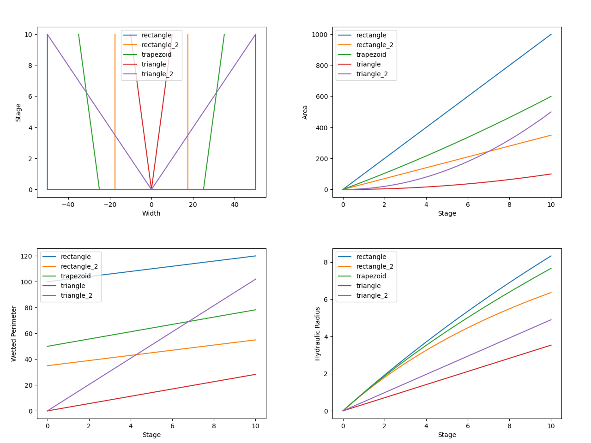

## Classifying Floodplain Types for Flood Attenuation

This repository provides tools to explore the influence of floodplain-channel connectivity on flood celerity and flood routing processes.  Current functionality includes
* Extraction of reach-averaged hydraulic geometry from DEMs
* Derivation of river reach "topographic signatures"

## Reach-averaging process

To analyze reach characteristics, we subset topographic information within a reach polygon.  We are currently using NHDPlus, NOAA hydrofabric, and VT Stream Geomorphic Assesment catchment data to delineate reach areas of influence.  The map below shows an example catchment area of influence.

Reach-averaged hydraulic parameters may then be extracted from the DEM within the area of influence.

## Signature clustering

"Topographic Signatures" are a concept that the University of Vermont is actively developing.  In simple terms, topo signatures represent the ease with which a river spills out into the adjacent terrain.  University of Vermont is currently using 1m DEM data and NHDPlus subcatchments to generate topographic signatures for ~3,000 reaches within the Lake Champlain Basin of Vermont. These topographic signatures will be used in a machine-learning analysis to explore emergent properties of floodplain-channel connectivity that influence flood routing.

