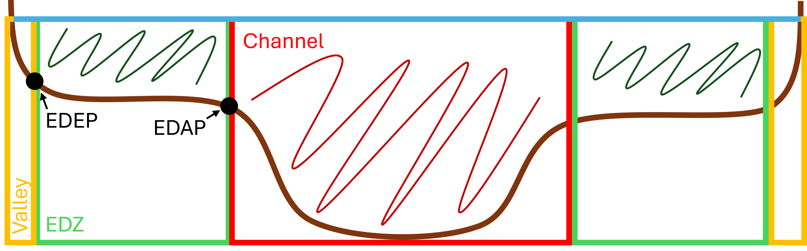

# How to generate flood-specific metrics with UVM's topographic extraction tools

Once reach-average cross-sections have been generated from DEM data (see [Tutorial 1](Topographic_Extraction.md)) and Energy Dissipation Zones have been identified (see [Tutorial 2](Feature_Extraction.md)), tools from this repository may be used to derive various flood-specific metrics.  Most of these metrics subdivide the river into one of several zones based on the Energy Dissipation Access Point (EDAP) and Energy Dissipation Exit Point (EDEP).  A rough schematic of the zones is shown below.



A list of available metrics are shown in the table below.

**Variable**|**Definition**|**Unit**
-----|-----|-----
event\_volume|Cumulative volume of floodwater that fluxes through the section flow-area for a given flood|M^3
event\_volume\_ch|Cumulative volume of floodwater that fluxes through the flow-area above the channel for a given flood|M^3
event\_volume\_edz|Cumulative volume of floodwater that fluxes through the flow-area above the EDZ for a given flood|M^3
event\_ssp|Cumulative specific stream power exerted on the section for a specific flood event|Joules/M^2
event\_ssp\_ch|Cumulative specific stream power exerted on the channel for a specific flood event|Joules/M^2
event\_ssp\_edz|Cumulative specific stream power exerted on the EDZ for a specific flood event|Joules/M^2
tw\_sec|Wetted top-width of the section at peak discharge|M
tw\_ch|Wetted top-width above the channel at peak discharge|M
tw\_edz|Wetted top-width above the EDZ at peak discharge|M
area\_sec|Cross-section flow area at peak discharge|M^2
area\_ch|Flow-area above the channel at peak discharge|M^2
area\_edz|Flow-area above the EDZ at peak discharge|M^2
vol\_sec|Volume of water in the reach at peak discharge|M^3
vol\_ch|Volume of water above the channel at peak discharge|M^3
vol\_edz|Volume of water above the EDZ at peak discharge|M^3
peak\_stage|River stage at peak discharge|M
peak\_stage\_scaled|River stage at peak discharge divided by bankfull depth|M/M
volume\_conservation|Error check.  Decimal percentage of hydrograph volume in event\_volume.   See note below.|M^3/M^3


Users may select a range of flood magnitudes and durations to run.  In the output table, the flood magnitude and duration are added as prefixes to all of the metrics above (ex. event_volume becomes Q100_Medium_event_volume).

**Volume Conservation Note:_**  To develop these metrics, various hydraulic geometry measures (flow-area, velocity, etc) are interpolated for each hydrograph ordinate.  In some cases (especially when discharges yield very small stages), the interpolated approximations may yield discrepancies between the event_volume metric and the direct integration of the flood hydrograph.  Such situations may be identified by low values for volume_conservation.  Any hydrograph metrics with low volume_conservation values (say, lower than 0.95) should be taken with a grain of salt or removed from the analysis.

## Discharge method

There are three options for how this script estimates the relationship between stage and discharge: 1-channel, 2-channel, and 3-channel.

The 1-channel option uses flow area and hydraulic radius of the whole section at each stage to develop a discharge using Manning's Equation.  The 2-channel option calculates discharge for the channel+valley and discharge for the EDZ at each stage and sums them to yield a total section discharge at each stage.  The 3-channel option calculates discharge within each zone seperately and sums them to yield a total section discharge at each stage.

The 2-channel and 3-channel options are inspired by the work of Matt et al. (2023), whereas the 1-channel option is more similar to the approach of Diehl et al. (2021)

## Running the script

Help for this command may be obtained by running the following command

```console
python source/floods.py -h
```

Example run command

```console
python source/floods.py /path/to/run_metadata.json ['Q2','Q100'], ['Short','Medium','Long']
```

or import the analyze_floods function from floods.py into your python script.

If no magnitudes or durations are provided, the script will run all hydrographs listed in the 'durations' dictionary of regressions.json.

The outputs are saved within the analysis folder of the run.


## References

Diehl RM, Gourevitch JD, Drago S, Wemple BC (2021) Improving flood hazard datasets using a low-complexity, probabilistic floodplain mapping approach. <i>PLOS ONE</i> 16(3): e0248683. https://doi.org/10.1371/journal.pone.0248683

Matt, J. E., Underwood, K. L., Diehl, R. M., Lawson, K. S., Worley, L. C., & Rizzo, D. M. (2023). Terrain-derived measures for basin conservation and restoration planning. <i>River Research and Applications</i>, 39(9), 1795–1811. https://doi.org/10.1002/rra.4181
