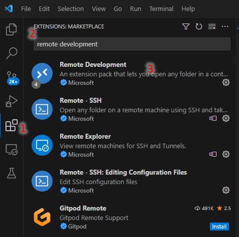

# How to Run Python Code on the CIROH Testbeds VM

1. Install Visual Studio Code (https://code.visualstudio.com/download)
2. Once it is downloaded, run the installer (VSCodeUserSetup-{version}.exe). This will only take a minute.
3. Open Visual Studio Code, navigate to the extensions (shortcut ctr+shift+x), and find the <strong>Remote Development</strong> extension.

4. Install Remote Development
5. Select <strong>Remote-SSH: Connect to Host...</strong> from the Command Palette (F1, Ctrl+Shift+P)
6. Fill in yournetid@ciroh-testbed.uvm.edu then press enter
7. When prompted for your password, type it, and press enter
8. Once you're in, open the folder 'data/floodplainScripts/floodplain-routing'
9. Code away!! (9.5 F5 is the shortcut to run/debug a script)
